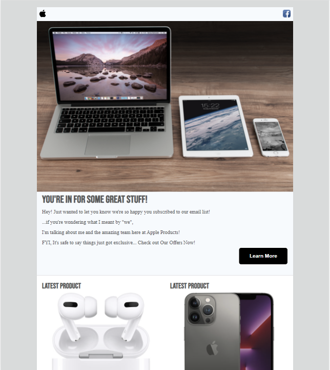

# Email Development for apple products newsletter
> Developed a apple products email with HTML, CSS
> Live demo [_here_](https://salmanghouse1.github.io/responsive-electronics-email/). 

## Table of Contents
* [General Info](#general-information)
* [Technologies Used](#technologies-used)
* [Features](#features)
* [Screenshots](#screenshots)
* [Setup](#setup)
* [Usage](#usage)
* [Project Status](#project-status)
* [Room for Improvement](#room-for-improvement)
* [Acknowledgements](#acknowledgements)
* [Contact](#contact)
<!-- * [License](#license) -->

## General Information
- an Email Layout
- Reach out to customers interested in apple products.
- To get more sales and customers(sample project)

## Technologies Used
- HTML
- CSS
- Google Fonts

## Features
- Responsive and Mobile Ready
- Social Media Icon
- Hover State Buttons

## Screenshots

<!-- If you have screenshots you'd like to share, include them here. -->

## Contact
Created by [salmanghouse1](https://www.salmanwebdeveloper.com/) - feel free to contact me!
